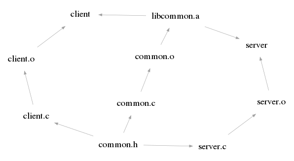

# Scalable Builds: An Introduction, via Bazel

## Why Do We Need Build Systems at All?

In the earliest days of computing there weren't even assemblers and compilers.
Programmers wrote directly in machine code by manually toggling switches on a
computer.

![PDP11-Front-Panel[^1]](Digital_PDP11-IMG_1498_cropped.jpg)

Fortunately these earliest of build tools were soon developed, but build
systems did not arrive until quite a bit later. Tasks like compiling a few
source files into a binary can be managed quite well with a script; and for a
while software systems were no more complex than that.

## Incrementality: _"Only rebuild the changed parts."_

As programs grow larger and start requiring significant amounts of time to
build in their entirety, the ability to partially rebuild only the changed
parts of a program quickly becomes desirable. To do this it is necessary to
track the dependencies that exist between the various components of a software
build graph. 



With this information and a set of changed source files, we can determine a
minimal sequence of actions to rebuild only the components that depend on the
changed source files. A system with this property is called _incremental_.
Essentially all modern build systems support some form of incrementality, but
consider for a moment the potential issues it introduces.


## Correctness: _"Be sure to rebuild everything that should be rebuilt."_

What if the build graph we have does not accurately reflect reality? If it has
some edges missing, the build system might neglect to rebuild a component that
it should have. This violates expectations and can cause great confusion.
Building everything might take a long time, but at least it yields the
_correct_ result. However with some care and a few trade-offs, we can have both
incrementality and correctness.

Bazel ensures the build graph is correct by automatically deriving it and the
build actions to run, from the same source of truth. To be sure that the build
actions only access the files that they are meant to, Bazel has to be highly
restrictive about what it lets you express in this source of truth.  One
restriction is that all dependencies have to be statically known ahead of time.
Dynamically depending on unpredictable outputs from an action is not possible
in Bazel.

Most of the time you will simply be composing high level rules like `cc_binary`
or `cc_library`:

```python
copts = ["-std=c++17"]

cc_library(
    name = "common",
    hdrs = ["common.h"],
    srcs = ["common.c"],
    visibility = ["//visibility:public"],
    copts = copts,
)

cc_binary(
    name = "server",
    srcs = ["server.c"],
    deps = [":common"],
    visibility = ["//visibility:public"],
    copts = copts,
)
```

If there is no standard rule for doing what you need, you can run an arbitrary
bash script with `genrule`:

```python
genrule(
    name = "uppercase",
    tools = ["@sed"],
    srcs = ["file.txt"],
    outs = ["file_uppercase.txt"],
    cmd = "$(execpath @sed) 's/.*/\U&/' $< > $@",
    visibility = ["//visibility:public"],
)
```

But then, what is to prevent the bash script from accessing files it should not,
thereby breaking correctness? Use `genrule` with caution. The onus is on you to
properly express its dependencies. If you fail to do so, Bazel cannot guarantee
correctness.

## Sandboxing: _"Run build actions in a restricted environment."_

Sandboxing is a feature provided by some build systems. It helps alleviate the
problems associated with escape hatches like `genrule`. While it can't save you
from writing bad rules, it does cause the build to fail when they run. In
practice this is nearly as good. A failing build is very obvious, and will be
fixed far sooner than a build which silently skips rebuilding some things,
under some circumstances.

Bazel provides sandboxing on Linux by using namespaces to ensure a build action
runs in a highly restricted environment, where it only has access to its
declared input files. If an action attempts to access an undeclared file, the
build will fail with an error saying the file is missing. It goes much further
than this though. Actions also have no network access, and cannot see other
running processes.

A sandbox can also be helpful to avoid accidentally damaging your development
environment with buggy builds; but it should not be considered secure if your
build is infected with malware. Sandboxes are not designed to protect against
intentional escape.

## Hermeticity: _"All build dependencies are explicitly declared."_

It is usual to make a distinction between internal and thirdparty dependencies.
From a developers perspective this is sensible — we can far more easily change
our own code, than we can code in a thirdparty library — but this distinction
tends to get manifested in build systems too.

Thirdparty dependencies are often not managed by the build system; they change
relatively infrequently so what would be the benefit? There are also challenges
with doing so. Your build system would have to fetch thirdparty dependencies,
possibly for different languages, and across multiple package repositories.
Instead it is common to just assume that the required tools and thirdparty
libraries have already been installed on the system somehow, without bothering
about the details. This relaxed attitude gives rise to a couple of problems
though.

It leads to cryptic errors from compilers and other low level tools, when
thirdparty dependencies are missing. The dependencies are implicit, and the
build system is not able to check for them and warn the user in a more friendly
way when they are not present. Worse than this though, a dependency might be
present but not have the expected version.

In this situation, we should count ourselves very lucky if the build merely
fails with an error. A far less pleasant alternative is the build succeeds, but
the runtime behaviour of our program is subtly broken by the version change.
The chance of this happening is much higher in languages without strong type
systems, as they are less able to check and enforce assumptions at compile
time.

If we want to avoid these problems, we must be explicit about expressing all
the tools and dependencies required to build our software. A build which
achieves this is said to be _hermetic_. It can still be valuable to attain a
degree of hermeticity, even when achieving it fully is too difficult.

Bazel is fairly agnostic when it comes to hermeticity. It is strict about
internal dependencies, but will happily let you take undeclared dependencies on
system libraries and tools. If you want your build to be truly hermetic, you
must write Bazel rules to fetch and run these libraries and tools yourself.
Sandboxing can be helpful in discovering undeclared dependencies.

Another way to solve these implicit dependency problems, is to simply run all
your builds in the same fixed environment — a docker container for example.
Though easier, and probably the pragmatic choice when you first migrate to
Bazel, there are disadvantages to this approach. The container image will need
to be rebuilt in full, even for a minor version change of a minor library. It
might also grow very large, making distribution difficult.

## Reproducibility: _"Bitwise identical outputs, from identical source code."_

A build tool is _deterministic_ when it produces bitwise identical output,
across different runs, whenever it is given the same input. Exactly what this
means, depends on how we define input. At a minimum we usually mean the same
input files and environment variables, but it is also necessary to use fixed
timestamps and avoid network access. Sandboxing is again helpful here.

In essence, deterministic tools are pure functions of their inputs. Actually
achieving this as a tool author, is not trivial. Random number generators
should be avoided of course, but there are other less obvious sources of
non-determinism; hash tables and thread scheduling for example. Thankfully a
lot of effort has been spent on this in recent years, and modern tools are
mostly deterministic.

When we combine determinism with hermeticity we get _reproducibility_, which is
something of a holy grail for build systems. If every single tool and library
needed is tracked to an exact commit, and if all of those tools are
deterministic, then it is possible to produce a build artifact with a fixed
hash, regardless of when or where you build it.

Reproducibility has numerous benefits, one of which is helping to secure the
software supply chain. It is far easier to publish source code and a sign an
expected hash, than it is to host build artifacts securely. The source can then
be built by anyone, on any system. Insecure environments do not constitute a
problem, since any malware that is present will be unable inject a backdoor
into an artifact without altering its hash.

## Remote Caching: _"Avoid repeating actions that have already been run."_

When your build is reproducible, it is safe to copy a prebuilt artifact from
elsewhere, and avoid having to build it from source yourself. The content of
the resulting artifact file will be the same in either case. This requires us
to be able to address and store content:

```proto
service ContentAddressableStorage {
  rpc FindMissingBlobs(FindMissingBlobsRequest) returns FindMissingBlobsResponse;
  rpc BatchUpdateBlobs(BatchUpdateBlobsRequest) returns BatchUpdateBlobsResponse;
  rpc BatchReadBlobs(BatchReadBlobsRequest) returns BatchReadBlobsResponse;
}
```

But what use is a content-addressable store on its own, without knowing what
hashes to look up? The trick is to cache the actions, as well as the files they
produce. Whichever system is the first to run a particular build action, will
record the result in the `ActionCache` and the output files in
`ContentAddressableStorage`.

```proto
service ActionCache {
  rpc GetActionResult(GetActionResultRequest) returns ActionResult;
  rpc UpdateActionResult(UpdateActionResultRequest) returns ActionResult;
}

message ActionResult {
  repeated OutputFile output_files = 2;
  int32 exit_code = 4;
  bytes stdout_raw = 5;
  bytes stderr_raw = 7;
}

message OutputFile {
  string path = 1;
  Digest digest = 2;
}
```

Other systems will then be able to walk the action-result graph, without
actually having to run the build actions themselves. An output file will only
need to be fetched when it is a final build output, or is needed as input to an
uncached action that is being run locally. Digests of the input files are
sufficient for determining the input root of an `Action`.

```proto
message Action {
  Digest command_digest = 1;
  Digest input_root_digest = 2;
}

message Command {
  repeated string arguments = 1;
  repeated EnvironmentVariable environment_variables = 2;
  repeated string output_files = 3;
}
```

There are various ways to configure remote caching. If cache poisoning is a
concern, you should only allow `UpdateActionResult` to be called by trusted CI
machines. You will miss out on the full benefits of remote caching — including
near instant CI runs on pull requests that have been built locally — but it's
still very worthwhile. Once one CI machine has built a commit, no one else
needs to again.


## Remote Execution: _"Request that an action be run for you remotely."_

Having gone this far to define a remote caching protocol, there is a very
natural extension that we can make. If `ActionCache` reports that a particular
`Action` result is not found, we can request that a remote executor run the
build action for us. When the action finishes, its result will be stored in the
cache for us to retrieve.

```proto
service Execution {
  rpc Execute(ExecuteRequest) returns Operation;
  rpc WaitExecution(WaitExecutionRequest) returns Operation;
}

message ExecuteRequest {
  Digest action_digest = 6;
}
```


## When Should You Use Bazel?

- Large complex monorepo projects.
- Projects with multiple languages.
- Any project without a (defacto) official build system, e.g.
  - C++
  - Haskell
- Arguable:
  - Medium sized `go` projects; use `go build` instead?
  - Medium sized `java` projects; use `gradle` instead?
  - Medium sized `rust` projects: use `cargo` instead?
  - etc

## The Future of Scalable Builds?

- Bazel is a great tool, but very complicated to use and not the final word.
- Newer scalable build systems are trying different approaches, e.g.
  - Buck2
  - Pants
- Dream build system?
  - Should have good support for many languages and mostly "just work".
  - Make it easy to depend on other software, so more hermetic than Bazel.
  - So probably something Nix based; but with incrementality as fine as Bazel's.


[^1]: https://creativecommons.org/licenses/by-sa/2.0/fr/deed.en
